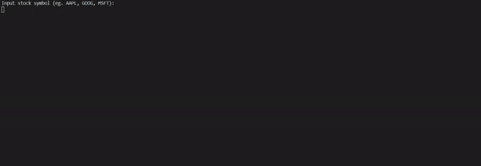

# Stock Parser Utility

## Overview

A shell script that lets the user input stock symbols and get the price for the desired stock.

## Usage

The follow instructions assume that you have the script in your current directory. 

**Step 1:** Obtain a free API key Financial Modeling Prep by creating a free account [here](https://financialmodelingprep.com/login "Sign Up Page").

**Step 2:** To ensure you have the right permissions, run the command below:

```bash
chmod 700 ./Stock_Parser.sh 
```

**Step 3:** To execute the script, run the command below with your `API_KEY` as an argument. 

```bash
./Stock_Parser.sh API_KEY
```

**Step 4:** To get share prices, enter a stock symbol when prompted(entering an empty string will exit the program):

```bash
Input stock symbol (eg. AAPL, GOOG, MSFT): # example symbols given
```

## Parsed Format

A table is generated with information on the company name and the quoted share price in US dollars.

| Symbol | Company Name | Price  |
|--------|--------------|--------|
| AAPL   | Apple Inc.   | 349.72 |


## API

The data is fetched from [Financial Modeling Prep API](https://financialmodelingprep.com/developer/docs/ "Home Page").

## Demonstration GIF


